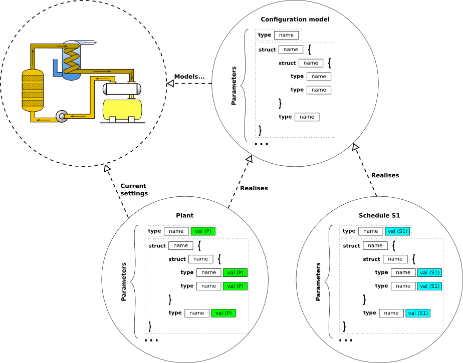
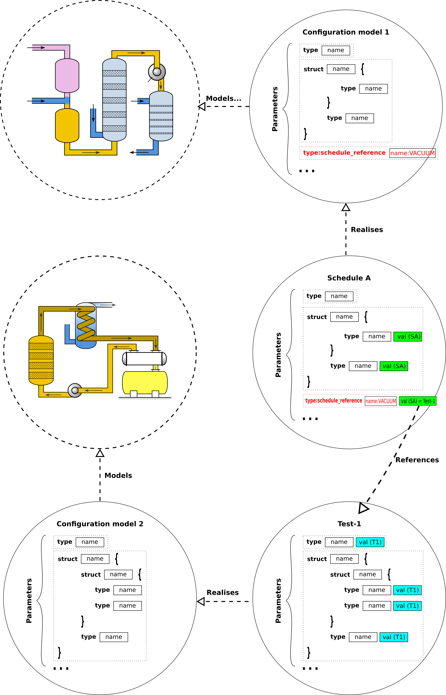
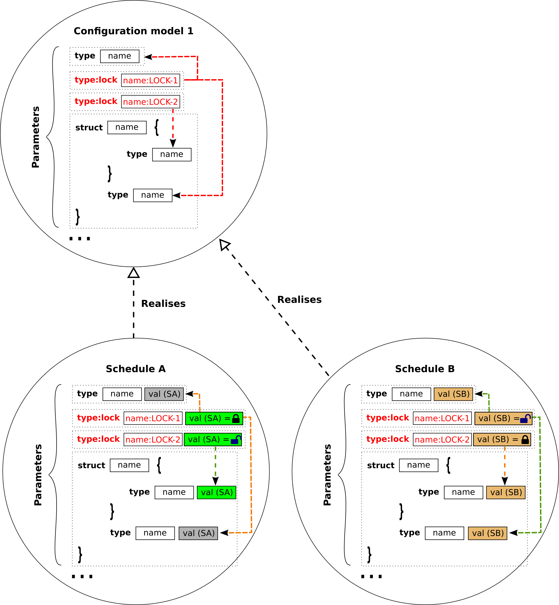
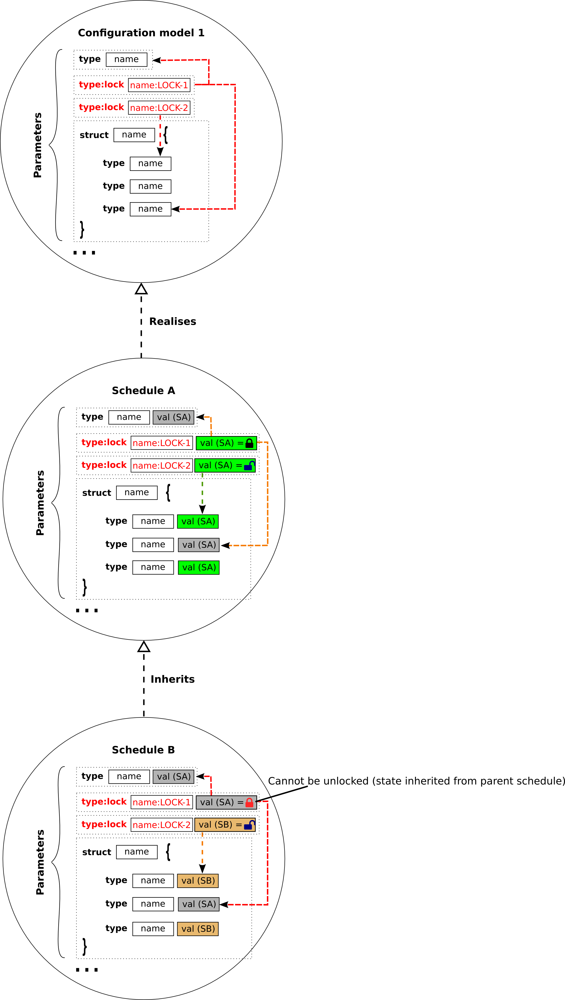
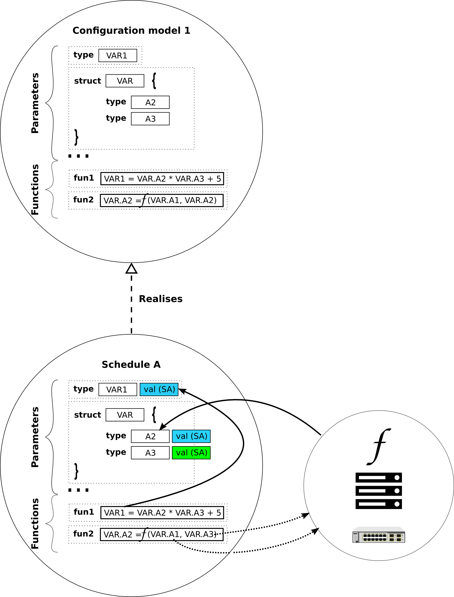

# Hieratika

Hieratika is a distributed parameter configuration system.

Hieratika provides a client-server infrastructure that allows to model and manage the configuration of plant systems. In particular it provides services that allow to store, compare, transform, validate and load different configurations of a given plant system. This is expected to be useful for the implementation life-cycle of a plant, from testing and commissioning to operation.    

## Glossary

| Term | Meaning | Example |
| ---- | ------- | ------- |
| Library | A type of parameter whose value is a reference to the values of a given subset of parameters. | Lib1 = {A = 2; B = 3}, Lib2 = {A = 1; B = 4}, LIB-PARAMETER=Lib1, where LIB-PARAMETER is the parameter name and Lib1 the parameter value. Note that in the plant the meaningful parameters are **A** and **B**, so that when the plant is updated, Hieratika will retrieve the values that are associated with Lib1 and load the value of **A** and **B** accordingly. |
| Live variable | Any plant variable that can be read but not modified by Hieratika. | Power supply output voltage; Switch position; ... | 
| Parameter | Any named variable that is susceptible of being configured. | Maximum pressure value; ADC number of bits; ... |
| Plant | The value of all the parameters that are to be loaded into the physical plant. | Vacuum system; power supply; pump; scientific code; ... |
| Schedule | Named snapshot of a configuration. Stores the values of all the parameters at the time of the schedule creation (or updating). | Schedule for test; Schedule for operation during commissioning; Schedule for normal operation; ... |

## Functions

The main functions of Hieratika are to:
* \[F1\] Enable the configuration of any plant (independently of its complexity);

* \[F1.1\] Some parameters can be a reference to a given schedule instance on another plant (e.g. VACUUM = TEST-1, where TEST-1 is the name of a schedule);

* \[F1.2\] Some parameters can be a reference to a library instance (e.g. ALARMS = TEST-1, where TEST-1 is the name of a library of a given type: LIB1 in the figure below);

* \[F1.3\] Parameters can be described as a structure of any complexity;
* \[F1.4\] The type of the leafs of the structure shall be of any basic type as defined [here](server/hieratika/variable.py).
* \[F2\] Enable the storing and retrieval of an unlimited number of configuration snapshots (schedules);
* \[F2.1\] Prevent the deleting of a schedule if it is referenced by a variable in any other schedule;
* \[F2.2\] Prevent the deleting of a library if it is referenced by a variable in any schedule;
* \[F2.3\] Lock a parameter from being editing based on the state of another parameter;

* \[F2.4\] Enable to inherit the locking status of a parameter when creating a new schedule. If the parameter was locked in the parent schedule it shall not be editable in the inherited schedule.

* \[F3\] Allow the validation of the configuration parameters;
* \[F3.1\] Some parameters are to be validated using mathematical expressions which might involve other parameters (e.g. PAR1 < (PAR2 * PAR3));
* \[F3.2\] Some parameters are to be validated using complex algorithms that might be written in any modern programming language;
* \[F3.3\] Some parameters are to be validated as a function of the value of parameters that belong to a different plant (e.g. VACUUM-PAR1 * FACTOR < POWER-SUPPLY-PAR2);
* \[F3.3\] Some parameters are to be validated as a function of the value of live variables (e.g. POWER-SUPPLY-1-MAX-CURRENT * FACTOR < POWER-SUPPLY-2-CURRENT-VOLTAGE);
* \[F4\] Allow the transformation of configuration parameters;
* \[F4.1\] Some parameters are to be transformed using mathematical expressions which might involve other parameters (e.g. PAR1 = (PAR2 * PAR3));
* \[F4.2\] Some parameters are to be transformed using complex algorithms that might be written in any modern programming language;

* \[F5\] Allow the development of graphical widgets which allow users to interface with the configuration and the live parameters;
* \[F5.1\] Update and validate the values of the configuration parameters;
* \[F5.2\] Trigger the execution of complex validation algorithms;
* \[F5.3\] Trigger the execution of transformation validation algorithms;
* \[F5.4\] Compare the current parameter value against the value in the plant;
* \[F5.5\] Compare the current parameter value against the value in a given schedule;
* \[F5.6\] Copy the parameter value from the value in the plant;
* \[F5.7\] Copy the parameter value from the value in a given schedule;
* \[F6\] Enable multi-user access to the configuration process. 
* \[F6.1\] Allow users to concurrently edit and store private configuraton schedules;
* \[F6.2\] Allow users to concurrently compare and copy from others' schedules;
* \[F6.3\] Prevent users from editing other users schedules;

## TODO
-   Create the statistics backend (should these be persistent??)
-   Rename the page concept to configuration model/object - NOT DONE
-   Document the design - NOT DONE
-   Write unit tests for the server - NOT DONE
-   Port the sqlite backend - NOT DONE
-   Setup the unit testing infrastructure for the client - NOT DONE
-   Write unit tests for the client - NOT DONE
-   DAP are just normal schedules associated to a given user (make sure that the standalone implementation also supports this) - TODO - make sure this is clear in the documentation.
