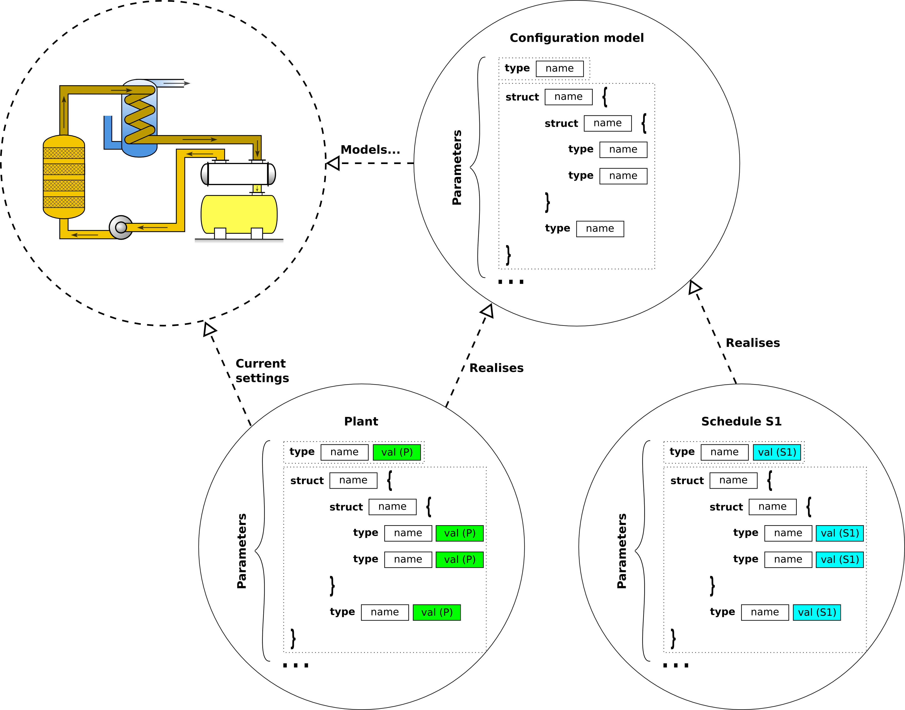
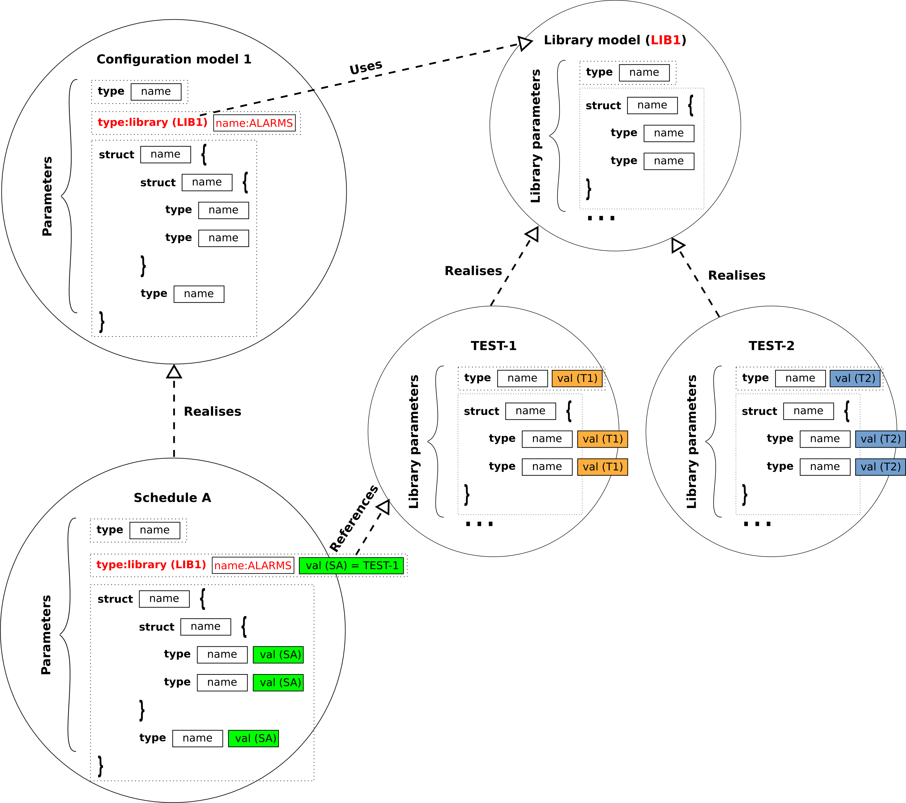

# Hieratika

Hieratika is a distributed parameter configuration system.

Hieratika provides a client-server infrastructure that allows to model and manage the configuration of plant systems. It offers services that allow to store, compare, transform, validate and load plant system configurations. These services are expected to support the life-cycle of a plant development, from testing and commissioning to operation.    

## Glossary

| Term | Meaning | Example |
| ---- | ------- | ------- |
| Library | A type of parameter whose value is a reference to the values of a subset of parameters. | Lib1 = {A = 2; B = 3}, Lib2 = {A = 1; B = 4}, LIB-PARAMETER=Lib1, where LIB-PARAMETER is the parameter name and Lib1 the parameter value. Note that in the plant the meaningful parameters are **A** and **B**, so that when the plant is updated, Hieratika will retrieve the values that are associated with Lib1 and load the value of **A** and **B** accordingly. |
| Live variable | Any plant variable that can be read but not modified by Hieratika. | Power supply output voltage; Switch position; ... | 
| Lock | A parameter that is locked is not modifiable. | Maximum expert voltage. | 
| Obsolete | A Schedule or Library that are marked as obsolete should no longer be used in new configurations. | Schedule used for the acceptance of a system which has been modified. |  
| Parameter | Any named variable that is susceptible of being configured. | Maximum pressure value; ADC number of bits; ... |
| Plant | The value of all the parameters that are to be loaded into the physical plant. | Vacuum system; power supply; pump; scientific code; ... |
| Schedule | Named snapshot of a configuration. Stores the values of all the parameters at the time of the schedule creation (or updating). | Schedule for test; Schedule for operation during commissioning; Schedule for normal operation; ... |
| UID | Unique identifier | |

## Functions

The main functions of Hieratika are to:
* \[F1\] Enable the configuration of any plant (independently of its complexity);

* \[F1.1\] Some parameters can be a reference to a given schedule instance on another plant (e.g. VACUUM = TEST-1, where TEST-1 is the name of a schedule);

* \[F1.2\] Some parameters can be a reference to a library instance (e.g. ALARMS = TEST-1, where TEST-1 is the name of a library of a given type: LIB1 in the figure below);

* \[F1.3\] Parameters can be described as a structure of any complexity;
* \[F1.4\] The type of the leafs of the structure shall be of any basic type as defined [here](server/hieratika/variable.py).
* \[F2\] Enable the storing and retrieval of an unlimited number of configuration snapshots (schedules);
* \[F2.1\] Prevent the deleting of a schedule if it is referenced by a variable in any other schedule;
* \[F2.2\] Prevent the deleting of a library if it is referenced by a variable in any schedule;
* \[F2.3\] Lock a parameter from being editing based on the state of another parameter;

* \[F2.4\] Enable to inherit the locking status of a parameter when creating a new schedule. If the parameter was locked in the parent schedule it shall not be editable in the inherited schedule;

* \[F2.5\] Allow to organise schedules inside folders; 
* \[F2.6\] Allow to organise libraries inside folders; 
* \[F2.7\] Allow to mark schedules as obsolete; 
* \[F2.8\] Allow to mark libraries as obsolete; 
* \[F3\] Allow the validation of the configuration parameters;
* \[F3.1\] Some parameters are to be validated using mathematical expressions which might involve other parameters (e.g. PAR1 < (PAR2 * PAR3));
* \[F3.2\] Some parameters are to be validated using complex algorithms that might be written in any modern programming language;
* \[F3.3\] Some parameters are to be validated as a function of the value of parameters that belong to a different plant (e.g. VACUUM-PAR1 * FACTOR < POWER-SUPPLY-PAR2);
* \[F3.4\] Some parameters are to be validated as a function of the value of live variables (e.g. POWER-SUPPLY-1-MAX-CURRENT * FACTOR < POWER-SUPPLY-2-CURRENT-VOLTAGE);
* \[F3.5\] The validation of configuration parameters using complex algorithms shall not block the user from validating or configuring other parameters;

* \[F4\] Allow the transformation of configuration parameters;
* \[F4.1\] Some parameters are to be transformed using mathematical expressions which might involve other parameters (e.g. PAR1 = (PAR2 * PAR3));
* \[F4.2\] Some parameters are to be transformed using complex algorithms that might be written in any modern programming language;
* \[F4.3\] The transformation of configuration parameters using complex algorithms shall not block the user from transforming or configuring other parameters;

* \[F5\] Allow the development of graphical widgets which allow users to interface with the configuration and the live parameters;
* \[F5.1\] Update and validate the values of the configuration parameters;
* \[F5.2\] Trigger the execution of complex validation algorithms;
* \[F5.3\] Trigger the execution of transformation validation algorithms;
* \[F5.4\] Compare the current parameter value against the value in the plant;
* \[F5.5\] Compare the current parameter value against the value in a given schedule;
* \[F5.6\] Copy the parameter value from the value in the plant;
* \[F5.7\] Copy the parameter value from the value in a given schedule;
* \[F6\] Enable multi-user access to the configuration process; 
* \[F6.1\] Allow users to concurrently edit and store private configuration schedules;
* \[F6.2\] Allow users to concurrently compare and copy from others' schedules;
* \[F6.3\] Prevent users from editing other users schedules.
* \[F7\] Inform users about any of the following changes:
* \[F7.1\] Values of a given plant;
* \[F7.2\] Values of a given schedule;
* \[F7.3\] Update of a given transformation function.

## Architecture

Hieratika is a **RESTful** client-server application with a well defined API based on HTTP and JSON for data representation.

By design Hieratika makes no assumptions on the:

* database technology that is used to store the parameters;
* plant system loading mechanisms and interfaces;
* programming languages and libraries for the parameter validations;
* plant system live variables monitoring interfaces;
* authentication technology that is used to validate the user operations.

The current implementation consists on a python web-server based on [Flask](http://flask.pocoo.org/) which offers and HTTP/JSON API to the clients. 
  


### REST API

The REST API is offered by the [wservermain interface](server/hieratika/wservermain.py). This interface delegates the API calls to one of the *JSON to python translators* modules. Each of these modules may have one or more plugins registered, which implement the API function call in python. 

| Translator | Plugin parent | Description |
| -------- | ----------- | ---------- |
| [wserver](server/hieratika/wserver.py) | [HieratikaServer](server/hieratika/server.py) | Plant parameters database interface. |
| [wloader](server/hieratika/wloader.py) | [HieratikaLoader](server/hieratika/loader.py) | Plant loading mechanisms. |
| [wtransformation](server/hieratika/wtransformation.py) | [HieratikaTransformation](server/hieratika/transformation.py) | Transformation functions. |
| [wmonitor](server/hieratika/wmonitor.py) | [HieratikaMonitor](server/hieratika/monitor.py) | Variables live monitoring. |

Upon a successful login (see [login @ wserver](server/hieratika/wserver.py) and [authenticate @ auth](server/hieratika/auth.py)) the API caller will receive a unique token that shall be used on all subsequent calls to the API.

The default [parameters server](server/hieratika/servers/psps/pspsserver.py) is based on a filesystem database where each plant system is modelled using the [ITER Pulse Schedule Preparation System (PSPS)](https://static.iter.org/codac/cs/CODAC_Operational_Applications_Release_N_S3WV58_v1_2.pdf) configuration objects XML structure.  

Detailed information about the API parameters and return values can be found by building the server-api documentation.

```
cd docs/server-api
make html
```

### HTML5 Client

The standard Hieratika client is an HTML5 based application. For the sake of code clarity and organisation, it heavily relies on the JavaScript [ECMAScript version 6](http://es6-features.org) implementation on the concepts of [HTML5 Custom Elements](https://developers.google.com/web/fundamentals/web-components/), i.e. HTML5 Web Components.


The user-interface for a given plant configuration model (see [Page](server/hieratika/page.py)) are developed by assembling HTML5 components ([htk-component](clients/html5/htk-component.html)) on an HTML page and by connecting such components to the [configuration parameters](server/hieratika/variable.py). 

Hieratika already offers a palette of ready to be used components, but it is expected that many application specific components will be developed by either extending existing components or by developing new components (always inheriting from [HtkComponent](clients/html5/htk-component.html)). The architecture expects that by inheriting from HtkComponent most of the component development effort is dedicated to the graphical rendering details on how a given component should be updated when its value changes. The HtkComponent already encapsulates all the required interfaces to receive streaming updates from the server and to be informed about changes to the current plant and schedule values.  

The interface to the REST API is provided by the [HtkHelper](clients/html5/htk-helper.html) component. The pattern always consists on an AJAX remote call where the caller is constrained to pass two function callback references: one to be called if the request was successful and another if an error has occurred while executing the remote call.

The [HtkNav](clients/html5/htk-nav.html) component provides the user-interface controls, including:

* [User access](clients/html5/htk-login.html);
* Selection of the [configuration](clients/html5/htk-schedule-selector.html) model to visualise;
* [Editing, creation and deletion of schedules](clients/html5/htk-page-selector.html);
* Comparing the current schedule against another schedule or the plant;
* Copying from another schedule or from the plant;
* Commiting changes performed on a given schedule;
* Undoing changes performed on a given schedule; 
* Triggering the execution of remote functions;
* Loading the current schedule into the plant.

The [HtkMainEditor](clients/html5/htk-main-editor.html) offers the iframe to hold the components that represent a given Hieratika page.

The inline (mathematical) validation of the functions declared in the configuration model is performed using the component [HtkValidation](clients/html5/htk-validation.html), using the [mathjs](http://mathjs.org/) library.  

#### Standard widgets

| Name | tag | Description |
| -------- | --- | --------- |
| [Htk2DLinePlot](clients/html5/htk-2d-line-plot.html) | \<htk-2d-line-plot\> | 2d line plot component based on [www.chartjs.org](www.chartjs.org) (see attachedCallback for available options) |
| [HtkAbstractInput](clients/html5/htk-abstract-input.html) | \<htk-abstract-input\> | Provides common methods for all the standard input components. |
| [HtkArrayEditor](clients/html5/htk-array-editor.html) | \<htk-array-editor\> | Array editor. |
| [HtkEnum](clients/html5/htk-enum.html) | \<htk-enum\> | Enum editor component implemented using an HTML select. |
| [HtkInput](clients/html5/htk-input.html) | \<htk-input\> | Standard text input component. |
| [HtkLibrary](clients/html5/htk-library.html) | N/A | An abstract class where components that are to handle library variables should inherit from. |
| [HtkLibraryButton](clients/html5/htk-library-button.html) | \<htk-library-button\> | A button which opens a [htk-library-editor](clients/html5/htk-library-editor.html). The value of this component is the name of the selected library (username/libraryname). |
| [HtkLibraryEditor](clients/html5/htk-library-editor.html) | \<htk-library-editor\> | An editor which is capable of rendering a library content (by displaying its associated page) and of managing libraries (creation, deletion, ...). |
| [HtkLockButton](clients/html5/htk-lock-button.html) | \<htk-lock-button\> | A button which renders an Hieratike Lock type. |
| [HtkScheduleButton](clients/html5/htk-schedule-button.html) | \<htk-schedule-button\> | A button which opens a htk-schedule-selector. The value of this component is the UID of the selected schedule. |
| [HtkStructBrowser](clients/html5/htk-struct-browser.html) | \<htk-struct-browser\> | Renders an Hieratika structured variable with a tree, where each node represents a member of the structure. |
| [HtkTextArea](clients/html5/htk-textarea.html) | \<htk-textarea\> | Text area input component. |

### Function allocation

The functions described above are allocated to the following components in the server:

| Function | Component | Description |
| -------- | --------- | ----------- |
| [F1] Model configuration | [getVariablesInfo @ HieratikaServer](server/hieratika/server.py) | This method returns an array of [Variables](server/hieratika/variable.py). The Variable class may contain other Variable instances and can represent a structure of any required complexity. |
| [F1.1] Schedule reference | [Schedule](server/hieratika/schedule.py) and [Variable](server/hieratika/variable.py) | The [Variable](server/hieratika/variable.py) class supports the *schedule* type and allows to store as the value a unique identifier of the referenced schedule. |
| [F1.2] Library reference | [HLibrary](server/hieratika/library.py) and [Variable](server/hieratika/variable.py) | The [Variable](server/hieratika/variable.py) class supports the *library* type and allows to store as the value a unique identifier of the referenced library. |
| [F1.3] Structured parameters | [Variable](server/hieratika/variable.py) | See [F1]. |
| [F1.4] Basic types | [Variable](server/hieratika/variable.py) | See [F1]. |
| [F2] Schedule retrieval | [getSchedules @ HieratikaServer](server/hieratika/server.py) | This method returns an array of [Schedules](server/hieratika/schedule.py). |
| [F2.1] Schedule deleting | [incrementReferenceCounter, decrementReferenceCounter and getReferenceCounter @ PSPSServer](server/hieratika/servers/psps/pspsserver.py) | The PSPSServer implementation maintains a counter with the number of objects that are referencing any given Schedule and prevents the deletion of this Schedule if the counter value is > 0. |
| [F2.2] Library deleting | [incrementReferenceCounter, decrementReferenceCounter and getReferenceCounter @ PSPSServer](server/hieratika/servers/psps/pspsserver.py) | The PSPSServer implementation maintains a counter with the number of objects that are referencing any given Library and prevents the deletion of this Library if the counter value is > 0. |
| [F2.3] Parameter locking | [Variable](server/hieratika/variable.py) | The Variable class allows to set the unique identifier of another Variable (which locks this Variable). **TODO: only the client is implementing this check (the server allows to write over locked variables).** |
| [F2.4] Schedule linking | [Schedule](server/hieratika/schedule.py) and [inheritLocks @ PSPSServer](server/hieratika/servers/psps/pspsserver.py) | The Schedule class allows to set the name of a parent Schedule, from which this Schedule inherits. If the value of a Lock is set to 1 in the parent schedule, it will be set to -1 in the newly created Schedule, so to mark it as no modifiable. |
| [F2.5] Schedule folders | [createScheduleFolder and getScheduleFolders @ HieratikaServer](server/hieratika/server.py) | The schedules can be organised inside a tree of folders. |
| [F2.6] Library folders |**TODO** | Not implemented yet. |
| [F2.7] Obsolete schedules | [obsoleteSchedule @ HieratikaServer](server/hieratika/server.py), [obsoleteScheduleFolder @ HieratikaServer](server/hieratika/server.py) and [isObsolete @ Schedule](server/hieratika/schedule.py) | Both the individual schedules and the folders can be marked as obsolete. |
| [F2.8] Obsolete libraries | [obsoleteLibrary @ HieratikaServer](server/hieratika/server.py) and [isObsolete @ HLibrary](server/hieratika/hlibrary.py) |  |
| [F3] Allow the validation of the configuration parameters | [getTransformationsInfo @ HieratikaServer](server/hieratika/server.py) and [transform @ HieratikaTransformation](server/hieratika/transformation.py) | The getTransformationsInfo allows to declare any number of functions in a given configuration model. By implementing the abstract interface in the HieratikaTransformation, any transformation function can be implemented. The validation is assumed to be a transformation function which returns a boolean value. |
| [F3.1] Mathematical expressions | See [F3] | |
| [F3.2] Complex algorithms | See [F3] | |
| [F3.3] Validation with parameters from other plants | [setServer @ HieratikaTransformation](server/hieratika/transformation.py) | Any class inheriting from [HieratikaTransformation](server/hieratika/transformation.py) has access to the [HieratikaServer component](server/hieratika/server.py) to query the value of parameters from other plants. |
| [F3.4] Validation with live parameters | [setMonitor @ HieratikaTransformation](server/hieratika/transformation.py) | Any class inheriting from [HieratikaTransformation](server/hieratika/transformation.py) has access to the [HieratikaMonitor](server/hieratika/monitor.py) components to query the value of live variables **TODO implement setMonitors** |
| [F3.5] Non-blocking validation interface | [update @ HieratikaTransformation](server/hieratika/transformation.py) and [queueStreamData @ HieratikaServer](server/hieratika/server.py) | The component performing the validation is expected to asynchronously inform about the validation progress by calling the [update](server/hieratika/transformation.py) method. The HieratikaServer will then use Server Side Events to inform all the registered clients about the update. |
| [F4] Allow the transformation of configuration parameters | See [F3] | |
| [F4.1] Mathematical expressions | See [F3.1] | |
| [F4.2] Complex algorithms | See [F3.2] | |
| [F4.3] Non-blocking validation interface | See [F3.5] | |
| [F5] GUI widgets | See client function allocation. ||
| [F5.1] Update and valitation of parameters | See client function allocation. ||
| [F5.2] Trigger validation algorithms | See client function allocation. ||
| [F5.3] Trigger transformation algorithms | See client function allocation. ||
| [F5.4] Compare configuration values against plant | See client function allocation. ||
| [F5.5] Compare configuration values against other schedules | See client function allocation. ||
| [F5.6] Copy the values from a given plant | See client function allocation. ||
| [F5.7] Copy the values from a given schedule | See client function allocation. ||
| [F6] Multi-user access | [wservermain interface](server/hieratika/wservermain.py) | Provides the REST API. |
| [F6.1] Private schedules | [createSchedule @ HieratikaServer](server/hieratika/server.py) | Every (registered) user is allowed to create schedules. |
| [F6.2] Compare and copy schedules | [getSchedules @ HieratikaServer](server/hieratika/server.py) | Every (registered) user is allowed to retrieve schedules from other users. |
| [F6.3] Prevent users from editing other users schedules | | **TODO Currently only protected at the client side**. |
| [F7] Live updates | [stream @ wservermain](server/hieratika/wservermain.py)  | Allows clients to register as listeners of server side events. |
[ [F7.1] Updates from plant changes | [queueStreamData @ HieratikaServer](server/hieratika/server.py), [streamData @ HieratikaServer](server/hieratika/server.py) and [updatePlant @ WServer](server/hieratika/server.py) | The WServer calls updatePlant on the HieratikaServer implementation, which returns a list with all the parameters that were updated. This list is then streamed to the clients by calling queueStreamData on the HieratikaServer. |
[ [F7.2] Updates from schedule changes | As 7.1 but with the method [updateSchedule @ WServer](server/hieratika/server.py) || 
[ [F7.3] Updates of transformation functions | See [F3.5] | | 

The functions described above are allocated to the following components in the HTML5 client:

| Function | Component | Description |
| -------- | --------- | ----------- |
| [F1] Model configuration | [loadVariablesInfo @ HtkMainEditor](clients/html5/htk-main-editor.html) and [getVariablesInfo @ HtkHelper](clients/html5/htk-helper.html) | The [HtkMainEditor](clients/html5/htk-main-editor.html) loads a given page from the server and calls getVariablesInfo to populate the widgets with the variables' information. |
| [F1.1] Schedule reference | [HtkScheduleButton](clients/html5/htk-schedule-button.html) and [HtkScheduleSelector](clients/html5/htk-schedule-selector.html) | The value of the HtkScheduleButton is the UID of the schedule selected by the user. The HtkScheduleSelector allows to select and assign a different schedule. |
| [F1.2] Library reference | [HtkLibrary](clients/html5/htk-library.html), [HtkLibraryEditor](clients/html5/htk-library-editor.html), [HtkLibraryButton](clients/html5/htk-library-button.html), and [getLibraries, getLibraryVariablesValues, deleteLibrary, saveLibrary and obsoleteLibrary @ HtkHelper](clients/html5/htk-helper.html) | Each library type is associated to one (and only one) HTML page with its own widgets. The HtkLibraryEditor provides the frame to hold this page, together with components that allow to manage the libraries and its values (create, delete, save, ...). The HtkLibraryButton is a standard component whose value is the UID of the library instance selected by the user and that allows to open an HtkLibraryEditor. |
| [F1.3] Structured parameters | [setVariable @ HtkComponent](clients/html5/htk-component.html) | The server side [Variable](server/hieratika/variable.py) is marshalled into a JSON structure. |
| [F1.4] Basic types | [setVariable @ HtkComponent](clients/html5/htk-component.html)  | See [F1.3]. |
| [F2] Schedule retrieval | [HtkScheduleSelector](clients/html5/htk-schedule-selector.html) and [getSchedules @ HtkHelper](clients/html5/htk-helper.html) | The HtkScheduleSelector allows to select and retrieve any of the schedules available for a given configuraton model. The AJAX interface to the server is encapsulated in the HtkHelper component. |
| [F2.1] Schedule deleting | [HtkScheduleSelector](clients/html5/htk-schedule-selector.html) and [deleteSchedule @ HtkHelper](clients/html5/htk-helper.html) | The HtkScheduleSelector allows to delete any of the schedules available for a given configuraton model. The AJAX interface to the server is encapsulated in the HtkHelper component and will fail if the Schedule is referenced by any given variable. |
| [F2.2] Library deleting | [HtkLibraryEditor](clients/html5/htk-library-editor.html) and [deleteLibrary @ HtkHelper](clients/html5/htk-helper.html) | The HtkLibraryEditor allows to delete any of the libraries available for a given variable in a configuraton model. The AJAX interface to the server is encapsulated in the HtkHelper component and will fail if the Library is referenced by any given variable. |
| [F2.3] Parameter locking | [setLockVariable, setLocked and isReadOnly @ HtkComponent](client/html5/htk-component.html) | A component will be set as read-only if setLocked is set to true. The name of variable locking this variable is automatically retrieved from the model. |
| [F2.4] Schedule linking | [HtkScheduleSelector](clients/html5/htk-schedule-selector.html) and [createSchedule @ HtkHelper](clients/html5/htk-helper.html) | When creating a new schedule, the HtkScheduleSelector allows to either copy or link to a source schedule. This information is propagated to server through the HtkHelper. |
| [F2.5] Schedule folders | [HtkScheduleSelector](clients/html5/htk-schedule-selector.html) and [createScheduleFolder and getScheduleFolders @ HtkHelper](clients/html5/htk-helper.html) | The HtkScheduleSelector allows to create (and delete) schedule folders. This information is then be propagated to server through the HtkHelper. |
| [F2.6] Library folders |**TODO** | Not implemented yet. |
| [F2.7] Obsolete schedules | [HtkScheduleSelector](clients/html5/htk-schedule-selector.html) and [obsoleteSchedule and obsoleteScheduleFolder @ HtkHelper](clients/html5/htk-helper.html) | Individual schedules and folders that are marked as obsolete cannot be selected. |
| [F2.8] Obsolete libraries | [obsoleteLibrary @ HtkLibraryEditor](clients/html5/htk-library-editor.html) | Libraries that are marked as obsolete cannot be selected |
| [F3] Allow the validation of the configuration parameters | [HtkValidation](clients/html5/htk-validation.html), [HtkValidationMath](clients/html5/htk-validation.html) and  [getValidations @ HtkComponent](clients/html5/htk-component.html) | Each HtkComponent can be associated to one or more validation functions. The HtkValidationMath evaluates simple mathematical expressions using [mathjs](http://mathjs.org/). The expressions may contain variables which are the parameters or live-variables. |
| [F3.1] Mathematical expressions | See [F3.1] | |
| [F3.2] Complex algorithms | [HtkTransformations](clients/html5/htk-transformations.html) | The HtkTransformations allows to trigger the execution of complex algorithms in the server side. |
| [F3.3] Validation with parameters from other plants | [getVariablesInfo @ HtkHelper](clients/html5/htk-helper.html) | The HtkHelper enables to retrieve parameters from other configuration models. |
| [F3.4] Validation with live parameters | [isLiveVariable @ HtkComponent](clients/html5/htk-component.html) | The live-variables are modelled as the configuration parameters so that the concepts explained in [F3] apply. |
| [F3.5] Non-blocking validation interface | [HtkTransformations](clients/html5/htk-transformations.html), [transform @ HtkHelper](clients/html5/htk-helper.html) and [HtkStream](clients/html5/htk-stream.html) | The HtkTransformation dialog is not modal. The HtkStream will fire a transformation update every time there is a server side event. |
| [F4] Allow the transformation of configuration parameters | See [F3] | |
| [F4.1] Mathematical expressions | See [F3.1] | |
| [F4.2] Complex algorithms | See [F3.2] | |
| [F4.3] Non-blocking validation interface | See [F3.5] | |
| [F5] GUI widgets | [HtkComponent](clients/html5/htk-component.html) | The user-interface is based on HTML5 custom elements. See the HTML5 client description above. |
| [F5.1] Update and valitation of parameters | [HtkComponent](clients/html5/htk-component.html) and [HtkStream](clients/html5/htk-stream.html) | Components inheriting from HtkComponent will be notified (if implementing the correct function) when the value (or any of the reference values) of the component changes.  |
| [F5.2] Trigger validation algorithms | See [F3.1] and [F3.5]. ||
| [F5.3] Trigger transformation algorithms | See [F3.1] and [F3.5]. ||
| [F5.4] Compare configuration values against plant | [HtkComponent](clients/html5/htk-component.html) and [HtkNav](clients/html5/htk-nav.html). | The HtkComponent knows about the its current value and about the plant value. The HtkNav allows to warn every HtkComponent that the user wants to compare the current value against the plant value. The component is then expected to renderer itself accordingly. |
| [F5.5] Compare configuration values against other schedules | [HtkComponent](clients/html5/htk-component.html) and [HtkNav](clients/html5/htk-nav.html). | The HtkComponent knows about the its current value and about the current selected schedule value. The HtkNav allows to warn every HtkComponent that the user wants to compare the current value against the currently selected schedule value. The component is then expected to renderer itself accordingly. |
| [F5.6] Copy the values from a given plant | [HtkComponent](clients/html5/htk-component.html) and [copyFromReferencePlantButton.onclick @ HtkNav](clients/html5/htk-nav.html). | The copyFromReferencePlantButton.onclick function retrieves the current plant values for all the components and calls setValue on all the HtkComponents. |
| [F5.7] Copy the values from a given plant | [HtkComponent](clients/html5/htk-component.html) and [copyFromSchedule @ HtkNav](clients/html5/htk-nav.html). | The copyFromSchedule function retrieves the current schedule values for all the components and calls setValue on all the HtkComponents. |
| [F6] Multi-user access | [HtkLogin](client/html5/HtkLogin.html) and [HtkHelper](client/html5/HtkHelper.html) | The HtkHelper implements the REST API. |
| [F6.1] Private schedules | [createSchedule @ HtkHelper](client/html5/HtkHelper.html) | Every (registered) user is allowed to create schedules. |
| [F6.2] Compare and copy schedules | [HtkScheduleSelector](clients/html5/htk-schedule-selector.html) and [getSchedules @ HtkHelper](clients/html5/htk-helper.html) | The HtkScheduleSelector allows to select and retrieve any of the schedules available for a given configuraton model. See also [F5.6] and [F5.7] |
| [F6.3] Prevent users from editing other users schedules | [copyFromSchedule @ HtkNav](clients/html5/htk-nav.html) and [setEditable @ HtkComponent](clients/html5/htk-component.html) | If the schedule does not belong to the user, every HtkComponent will have setEditable(false).  |
| [F7] Live updates | [HtkStream](clients/html5/HtkStream.html) | Propagates the server side events to the relevant HtkComponent. |
| [F7.1] Updates from plant changes | [HtkStream](clients/html5/HtkStream.html) and [setPlantValue @ HtkComponent](clients/html5/htk-component) | The HtkStream looks for the components associated to the updated parameter name (using the component id) and calls setPlantValue. |
| [F7.2] Updates from schedule changes | [HtkStream](clients/html5/HtkStream.html) and [setPlantValue @ HtkComponent](clients/html5/htk-component) | The HtkStream checks if the updated schedule is the one being displayed to this user. If so, it looks for the components associated to the updated parameter name (using the component id) and calls setValue. |
| [F7.3] Updates of transformation functions | [fireTransformationUpdated @ HtkStream](clients/html5/HtkStream.html) and [HtkTransformations](clients/html5/htk-transformations.html) | Registered components will be informed about transformation updates. | 

### Security

All the REST requests are associated to a token that is generated at login time by the authentication module plugin. 
Each request is then validated by the authentication module plugin using the function [isTokenValid](server/hieratika/auth.py).

### Statistics

The [WStatistics](server/hieratika/wstatistics.py) module maintains a local (non-persistent) database which is updated with the server execution time of all the API calls performed during the execution of Hieratika. TODO this component is still to be finished.  

### Configuration

The server requires a configuration file to start. This file is parsed using the python [ConfigParser](https://docs.python.org/2/library/configparser.html).

All the Hieratika server modules ([HieratikaServer](server/hieratika/server.py), [HieratikaAuth](server/hieratika/auth.py), [HieratikaMonitor](server/hieratika/monitor.py), [HieratikaLoader](server/hieratika/loader.py) and [HieratikaTransformation](server/hieratika/transformation.py)) are loaded as plugins using the python [importlib](https://docs.python.org/3/library/importlib.html). The configuration file is expected to declare *Sections* with the names *PLUGIN_TYPE-impl* where *PLUGIN_TYPE* is one of: server, monitor, auth, loader, transformation. Upon the start of the server, Hieratika will call the function **load** on all the registered plugins (see below). 

Some plugin types also have compulsory configurations that are common to all the plugin specialisations. These compulsory configuration are loaded by calling the function **loadCommon** on all the relevant plugins. 

The structure of the configuration file is divided in *Sections* and shall respect the following structure:

#### Section: [Hieratika]

Parameters that are common to all Hieratika modules.

| Parameter | Description | Example |  
| --------- | ----------- | ------- |  
| staticFolder | Location of the HTML5 standard client HTML pages (Flask static folder). | ../../clients/html5 | 
| pagesFolder | Location of the HTML user-interface pages associated to the plant where Hieratika is being used. | ../demo/server/pages |
| serverModule | The python module where to load the server class from. | hieratika.servers.psps.pspsserver |
| serverClass | The Hieratika server implementation. | PSPSServer |
| udpBroadcastQueuePort | The port that is used by the [BroadcastQueue](server/hieratika/util/broadcastqueue.py). | 23450 |
| structSeparator | Symbol which defines how member names in a structure variable name are separated. | @ |
| authModule | The module where to load the auth class from. | hieratika.auths.basicauth |
| authClass | The Hieratika auth implementation. | HieratikaBasicAuth |
| loginMonitorUpdateRate | The time interval (in seconds) at which the state of logged in users is to be checked. | 60 | 
| loginMonitorMaxInactivityTime | Maximum time that a given user can stay logged in without interacting with the server. | 600 |
| loginMaxUsers | Maximum number of users that can be logged in at any time. | 4 |
| standalone | If true Hieratika is expected to be used in single user mode. This information can be used by the Hieratika plugins (e.g. by the authentication module). | False |
| numberOfLocks | A [LockPool](server/hieratika/util/lockpool.py) is used to guarantee transactional access (process and thread safe) to the internal logic of Hieratika. This number defines the maximum number of semaphores that can be used in parallel. | 8 |
| statisticsUpdatePeriod | Update rate at which the statistics should be updated. | 1 |
| transformationModules | List of transformation plugin modules | ['ahkabdemo'] |  
| transformationClasses | List of transformation plugin classes | ['AhkabDemo'] |
| loaderModules | List of loader plugin modules | ['hieratika.loaders.noop.nooploader'] |  
| loaderClasses | List of loader plugin classes | ['NOOPLoader'] |
| monitorModules | List of monitor plugin modules | ['hieratika.monitors.epicsv3.epicsv3monitor'] |  
| monitorClasses | List of monitor plugin classes | ['EPICSV3Monitor'] |

#### Section: [server-impl]

Parameters that are specific to the parameter server implementation, e.g. the [PSPSServer](server/hieratika/servers/psps/pspsserver.py):

| Parameter | Description | Example |  
| --------- | ----------- | ------- |
| baseDir   | Base directory where all the XML files are stored. | ../demo/server/psps |
| numberOfLocks | A [LockPool](server/hieratika/util/lockpool.py) is used to guarantee transactional access (process and thread safe) to the database. This number defines the maximum number of semaphores that can be used in parallel. | 8 |
| maxXmlIds | Maximum number of xmlIds accelerators that are allowed at any given time (see getXmlId @ PSPSServer). | 32 |
| maxXmlCachedTrees | Maximum number of xml trees that can be cached in memory. | 16 |
| defaultExperts | Defines the experts that are to be associated to all the variables. | ['experts-1', 'experts-2'] |
| autoCreatePages | Automatically creates basic html pages for each plant system (if these don't exist already). | True |

#### Section: [auth-impl]

Parameters that are specific to the authentication module implementation, e.g. the [HieratikaBasicAuth](server/hieratika/auths/basicauth.py).

| Parameter | Description | Example |  
| --------- | ----------- | ------- |
| users     | Comma separated list of users that are authorised to use the system. The semicolon associates groups (experts) to the users. | gcc-configurator;experts-1;experts-2,codac-dev-1;experts-1;experts-2,codac-dev-2;experts-1,codac-dev-3 |

#### Section: [monitor-impl]

Parameters that are specific to the monitoring module implementation, e.g. the [EPICSV3Monitor](server/hieratika/monitors/epicsv3/epicsv3monitor.py).

| Parameter | Description | Example |  
| --------- | ----------- | ------- |
| variableListJsonPath | JSON file with the list of variables to be monitored. | ../demo/server/monitors/epicsv3/monitor.json |


## Deployment
  
The list of dependencies is declared [requirements](requirements.txt) file.

The server can be started using [gunicorn](http://gunicorn.org/):

```
gunicorn --preload --log-file=- -k gevent -w 16 -b 0.0.0.0:80 'hieratika.wservermain:start(config="PATH_TO_CONFIG.ini")
```

or directly python: 

```
python2.7 -m hieratika.wservermain -i PATH_TO_CONFIG.ini -H 0.0.0.0 -p 80
```

Note that all the plugins must be found in the *PYTHONPATH*.

## API documentation

The server API documentation can be built issuing the following commands:

```
cd docs/server-api
make html
```

The output will be available in the [API html folder](docs/server-api/build/html/index.html).

## Demos

Several demos are available in the [psps demo folder](demo/server/psps/).

