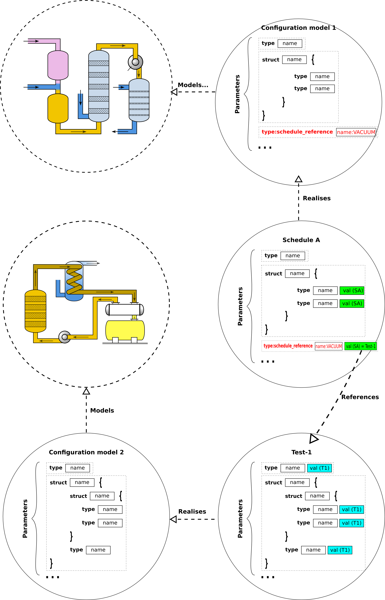
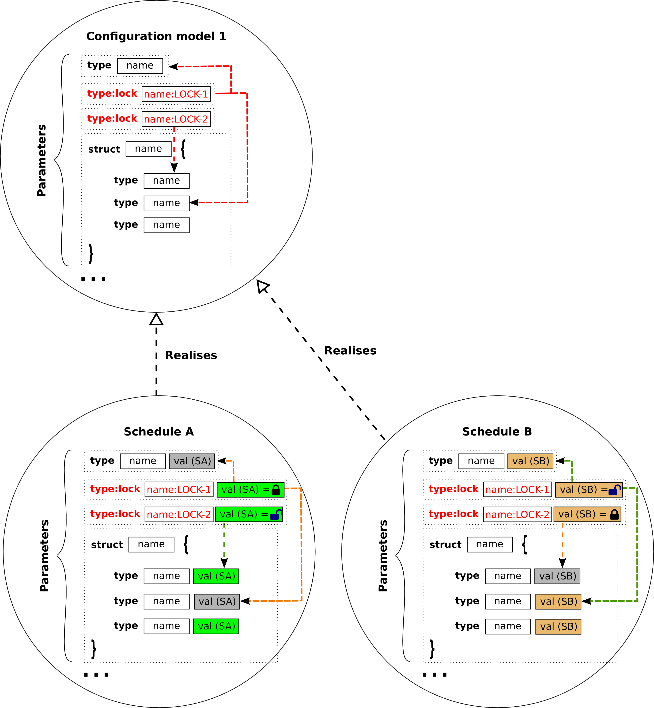

# Hieratika

Hieratika is a distributed parameter configuration system.

Hieratika provides a client-server infrastructure that allows to model and manage the configuration of plant systems. It offers services that allow to store, compare, transform, validate and load plant system configurations. These services are expected to support the life-cycle of a plant development, from testing and commissioning to operation.    

## Glossary

| Term | Meaning | Example |
| ---- | ------- | ------- |
| Library | A type of parameter whose value is a reference to the values of a subset of parameters. | Lib1 = {A = 2; B = 3}, Lib2 = {A = 1; B = 4}, LIB-PARAMETER=Lib1, where LIB-PARAMETER is the parameter name and Lib1 the parameter value. Note that in the plant the meaningful parameters are **A** and **B**, so that when the plant is updated, Hieratika will retrieve the values that are associated with Lib1 and load the value of **A** and **B** accordingly. |
| Live variable | Any plant variable that can be read but not modified by Hieratika. | Power supply output voltage; Switch position; ... | 
| Lock | A parameter that is locked is not modifiable. | Maximum expert voltage. | 
| Parameter | Any named variable that is susceptible of being configured. | Maximum pressure value; ADC number of bits; ... |
| Plant | The value of all the parameters that are to be loaded into the physical plant. | Vacuum system; power supply; pump; scientific code; ... |
| Schedule | Named snapshot of a configuration. Stores the values of all the parameters at the time of the schedule creation (or updating). | Schedule for test; Schedule for operation during commissioning; Schedule for normal operation; ... |

## Functions

The main functions of Hieratika are to:
* \[F1\] Enable the configuration of any plant (independently of its complexity);

* \[F1.1\] Some parameters can be a reference to a given schedule instance on another plant (e.g. VACUUM = TEST-1, where TEST-1 is the name of a schedule);

* \[F1.2\] Some parameters can be a reference to a library instance (e.g. ALARMS = TEST-1, where TEST-1 is the name of a library of a given type: LIB1 in the figure below);

* \[F1.3\] Parameters can be described as a structure of any complexity;
* \[F1.4\] The type of the leafs of the structure shall be of any basic type as defined [here](server/hieratika/variable.py).
* \[F2\] Enable the storing and retrieval of an unlimited number of configuration snapshots (schedules);
* \[F2.1\] Prevent the deleting of a schedule if it is referenced by a variable in any other schedule;
* \[F2.2\] Prevent the deleting of a library if it is referenced by a variable in any schedule;
* \[F2.3\] Lock a parameter from being editing based on the state of another parameter;

* \[F2.4\] Enable to inherit the locking status of a parameter when creating a new schedule. If the parameter was locked in the parent schedule it shall not be editable in the inherited schedule.

* \[F3\] Allow the validation of the configuration parameters;
* \[F3.1\] Some parameters are to be validated using mathematical expressions which might involve other parameters (e.g. PAR1 < (PAR2 * PAR3));
* \[F3.2\] Some parameters are to be validated using complex algorithms that might be written in any modern programming language;
* \[F3.3\] Some parameters are to be validated as a function of the value of parameters that belong to a different plant (e.g. VACUUM-PAR1 * FACTOR < POWER-SUPPLY-PAR2);
* \[F3.3\] Some parameters are to be validated as a function of the value of live variables (e.g. POWER-SUPPLY-1-MAX-CURRENT * FACTOR < POWER-SUPPLY-2-CURRENT-VOLTAGE);
* \[F3.4\] The validation of configuration parameters using complex algorithms shall not block the user from validating or configuring other parameters;

* \[F4\] Allow the transformation of configuration parameters;
* \[F4.1\] Some parameters are to be transformed using mathematical expressions which might involve other parameters (e.g. PAR1 = (PAR2 * PAR3));
* \[F4.2\] Some parameters are to be transformed using complex algorithms that might be written in any modern programming language;
* \[F4.3\] The transformation of configuration parameters using complex algorithms shall not block the user from transforming or configuring other parameters;

* \[F5\] Allow the development of graphical widgets which allow users to interface with the configuration and the live parameters;
* \[F5.1\] Update and validate the values of the configuration parameters;
* \[F5.2\] Trigger the execution of complex validation algorithms;
* \[F5.3\] Trigger the execution of transformation validation algorithms;
* \[F5.4\] Compare the current parameter value against the value in the plant;
* \[F5.5\] Compare the current parameter value against the value in a given schedule;
* \[F5.6\] Copy the parameter value from the value in the plant;
* \[F5.7\] Copy the parameter value from the value in a given schedule;
* \[F6\] Enable multi-user access to the configuration process; 
* \[F6.1\] Allow users to concurrently edit and store private configuraton schedules;
* \[F6.2\] Allow users to concurrently compare and copy from others' schedules;
* \[F6.3\] Prevent users from editing other users schedules.
* \[F6\] Inform users about any of the following changes:
* \[F6.1\] Values of a given plant;
* \[F6.2\] Values of a given schedule;
* \[F6.3\] Update of a given transformation function.

## Architecture

Hieratika is a **RESTful** client-server application with a well defined API based on HTTP and JSON for data representation.

By design Hieratika makes no assumptions on the:

* database technology that is used to store the parameters;
* plant system loading mechanisms and interfaces;
* programming languages and libraries for the parameter validations;
* plant system live variables monitoring interfaces;
* authentication technology that is used to validate the user operations.

The current implementation consists on a python web-server based on [Flask](http://flask.pocoo.org/) which offers and HTTP/JSON API to the clients. 
  


### REST API

The REST API is offered by the [wservermain interface](server/hieratika/wservermain.py). This interface delegates the API calls to one of the *JSON to python translators* modules. Each of these modules may have one or more plugins registered, which implement the API function call in python. 

| Translator | Plugin parent | Description |
| -------- | ----------- | ---------- |
| [wserver](server/hieratika/wserver.py) | [HieratikaServer](server/hieratika/server.py) | Plant parameters database interface. |
| [wloader](server/hieratika/wloader.py) | [HieratikaLoader](server/hieratika/loader.py) | Plant loading mechanisms. |
| [wtransformation](server/hieratika/wtransformation.py) | [HieratikaTransformation](server/hieratika/transformation.py) | Transformation functions. |
| [wmonitor](server/hieratika/wmonitor.py) | [HieratikaMonitor](server/hieratika/monitor.py) | Variables live monitoring. |

Upon a successful login (see [login @ wserver](server/hieratika/wserver.py) and [authenticate @ auth](server/hieratika/auth.py)) the API caller will receive a unique token that shall be used on all subsequent calls to the API.

The default [parameters server](server/hieratika/servers/psps/pspsserver.py) is based on a filesystem database where each plant system is modelled using the ITER PSPS configuration objects XML structure.  

Detailed information about the API parameters and return values can be found by building the server-api documentation.

```
cd docs/server-api
make html
```

The functions described above are allocated as follows:

| Function | Component | Description |
| -------- | --------- | ----------- |
| [F1] Model configuration | [getVariablesInfo @ HieratikaServer](server/hieratika/server.py) | This method returns an array of [Variables](server/hieratika/variable.py). The Variable class may contain other Variable instances and can represent a structure of any required complexity. |
| [F1.1] Schedule reference | [Schedule](server/hieratika/schedule.py) and [Variable](server/hieratika/variable.py) | The [Variable](server/hieratika/variable.py) class supports the *schedule* type and allows to store as the value a unique identifier of the referenced schedule. |
| [F1.2] Library reference | [HLibrary](server/hieratika/library.py) and [Variable](server/hieratika/variable.py) | The [Variable](server/hieratika/variable.py) class supports the *library* type and allows to store as the value a unique identifier of the referenced library. |
| [F1.3] Structured parameters | [Variable](server/hieratika/variable.py) | See [F1]. |
| [F1.4] Basic types | [Variable](server/hieratika/variable.py) | See [F1]. |
| [F2] Schedule retrieval | [getSchedules @ HieratikaServer](server/hieratika/server.py) | This method returns an array of [Schedules](server/hieratika/schedule.py). |
| [F2.1] Schedule deleting | [incrementReferenceCounter, decrementReferenceCounter and getReferenceCounter @ PSPSServer](server/hieratika/servers/psps/pspsserver.py) | The PSPSServer implementation maintains a counter with the number of objects that are referencing any given Schedule and prevents the deletion of this Schedule if the counter value is > 0. |
| [F2.2] Library deleting | [incrementReferenceCounter, decrementReferenceCounter and getReferenceCounter @ PSPSServer](server/hieratika/servers/psps/pspsserver.py) | The PSPSServer implementation maintains a counter with the number of objects that are referencing any given Library and prevents the deletion of this Library if the counter value is > 0. |
| [F2.3] Parameter locking | [Variable](server/hieratika/variable.py) | The Variable class allows to set the unique identifier of another Variable (which locks this Variable). **TODO: only the client is implementing this check (the server allows to write over locked variables).** |
| [F2.4] Schedule linking | [Schedule](server/hieratika/schedule.py) and [inheritLocks @ PSPSServer](server/hieratika/servers/psps/pspsserver.py) | The Schedule class allows to set the name of a parent Schedule, from which this Schedule inherits. If the value of a Lock is set to 1 in the parent schedule, it will be set to -1 in the newly created Schedule, so to mark it as no modifiable. |

### Configuration parameters

The server requires a configuration file to start.

gunicorn --preload --log-file=- -k gevent -w 16 -b 0.0.0.0:80 'hieratika.wservermain:start(config="PATH_TO_CONFIG.ini")
General

#### WServer

#### WLoader

#### WTransformation

#### WMonitor

#### Authentication


## TODO
-   Create the statistics backend (should these be persistent??)
-   Rename the page concept to configuration model/object - NOT DONE
-   Document the design - NOT DONE
-   Write unit tests for the server - NOT DONE
-   Port the sqlite backend - NOT DONE
-   Setup the unit testing infrastructure for the client - NOT DONE
-   Write unit tests for the client - NOT DONE
-   DAP are just normal schedules associated to a given user (make sure that the standalone implementation also supports this) - TODO - make sure this is clear in the documentation.
